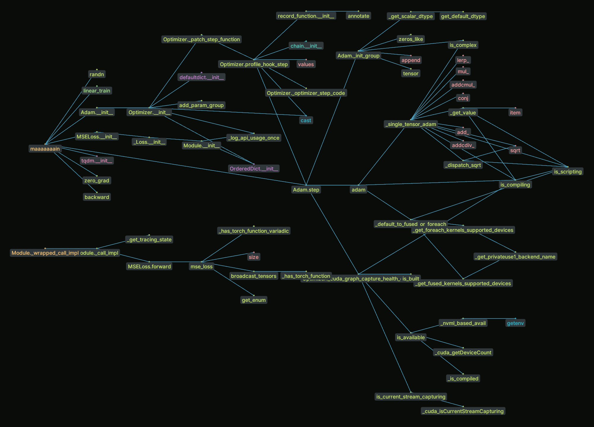

# maxray

> the problem with doing weird metaprogramming shit is having to deal with *other people's weird metaprogramming shit*

Trace and modify the result of (almost) every single expression executed in a Python program in realtime, without *any* changes to your source code. Very WIP.

This works by replacing the operation of "call this function $f$" with "rewrite the source code of $f$ via:
1. Obtain the source code and definition module of the function
2. Parse and transform the AST so that:
    a. functions referenced inside $f$ will get **recursively** transformed in the same manner
    b. expressions are wrapped with a "callback hook", attaching any metadata picked up along the way (e.g. source location)
3. Compile the modified AST in its original module and scope, dropping in this new function as a functionally-identical replacement for $f$"

## Example use cases

### Trace function calls across a program

Compared to tools relying on static analysis, this allows exactly resolving calls like `[fn_a, fn_b][rand() < 0.5]()`.

```sh
pip install maxray[all]
xpy -W 'callgraph:Draw --rerun' <your_script.py>
```



## Use as a script runner from the CLI

This package installs 2 CLI commands; `xpy` is the script runner that can be used by replacing `python your_script.py` with `xpy your_script.py`. The runner provides a way to dynamically "patch" arbitrary source expressions at runtime by defining a mapping `(x: Any, ray: RayContext) -> Any`. In lieu of (WIP) docs, check out some existing examples in `maxray/inators/`.

From the CLI, `-W` takes `path_to_file.py:symbol args...` or `module:symbol args...` (be careful with shell quoting) generated by `maxray template` (see below) and will hot-reload it on every filesystem change. Can be passed multiple times to compose transformations that are then applied sequentially.

```
Usage: xpy [OPTIONS] SCRIPT [ARGS]...

Options:
  -W, --watch TEXT
  -m, --module
  -l, --loop          Won't exit on completion and will wait for a file change
                      event to run the script again.
  -p, --preserve      Don't apply value transformations (e.g. automatically
                      unpacking assignments to allow matching)
  --local             Only patch and trace source code in the immediately
                      invoked script or module (an alias for `-i .`)
  -i, --include TEXT  By default all functions are recursively patched. If any
                      include flags are manually passed, only functions
                      belonging to included modules are allowed to be patched.
                      Use `-i .` to only include the script/module being run.
  -x, --exclude TEXT  Forbid modules passed in this list from being patched
                      (in addition to those hard-coded in
                      _GLOBAL_SKIP_MODULES)
  -q, --quiet         Disables display and interactive elements.
  --rerun             Use a rerun.io viewer as the display backend (requires
                      `rerun-sdk` to be installed)
  --help              Show this message and exit.
```


```
Usage: maxray template [OPTIONS] PATH

Options:
  --new
  --over
  -f, --force  Overwrite existing file
  --cli        Adds a static constructor that accepts CLI-style arguments
  --runner     Adds manual control to spawn multiple runs of the program
  --rerun      Imports rerun (requires the `rerun-sdk` package)
  --session    A restricted version of `runner` that is just a contextmanager
               entered for the lifetime of the program. Useful for cleanup or
               displaying/saving results
  --all        Enable all features
  --name TEXT  Name of the class to create
  --help       Show this message and exit.
```


## Use as a library

> [!NOTE]
> Will not work in a REPL -- save and run the code as a script or package.

```python
from maxray import transform, xray, maxray

from torch import tensor, Tensor, device


def move_tensor(x, ctx):
    if isinstance(x, Tensor) and x.device != device("cuda"):
        return x.to("cuda")
    return x


@transform(move_tensor)
def show_multiply(a, b):
    print(a @ b)

# Source code is rewritten to be equivalent to:

def _show_multiply(a, b):
    move_tensor(move_tensor(print, ...)(move_tensor(a, ...) @ move_tensor(b, ...)), ...)

# ---

show_multiply(
    tensor([[0.0, 1.0], [1.0, 1.0]], device="cpu"),
    tensor([[1.0], [1.0]], device="cuda"),
)  # Without the decorator, you'd expect `RuntimeError: Expected all tensors to be on the same device`

# tensor([[1.],
#         [2.]], device='cuda:0')
```

The `ctx` argument contains context information about the location of the original source code, which may be useful to build editor/LSP integrations.

The `*xray` decorators will recursively trace and patch every single callable they encounter until reaching either builtins, native, or generated code.


## Issues

If running a script or module with `xpy` deterministically results in differing output or exceptions compared to when run with `python` (CPython >= 3.11), that's a bug. A stopgap solution is to `--exclude` the offending modules to prevent them from being transformed.

> [!TIP] 
> `export MAXRAY_LOG_LEVEL=1` to show internal logging
